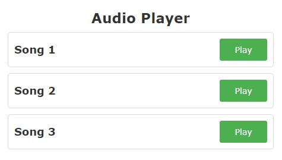

# Audio Player with Track List for Site - Powered by JQuery

A lightweight web application that lets you play a curated list of music tracks or ringtones (MP3, WAV, M4R and other formats). This audio player, crafted with JQuery, boasts a clean and user-friendly interface, allowing seamless navigation through your favorite tunes. Effortlessly switch between songs, pause, and play at your convenience.  The player automatically stops the currently playing song when a new one is selected.

Experience the simplicity and intuitiveness of this music player designed specifically for websites. Just clone the repository, open the index.html file in your web browser, and start enjoying your music!

## Preview

## Features:

* Play and pause functionality for each song.
* Responsive design for an optimal viewing experience on various devices.
* Easily customizable with your own list of songs.

## How to Use

1. Clone the repository to your local machine.
2. Open the `index.html` file in a web browser.

